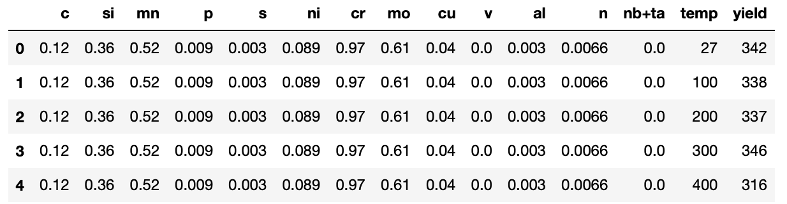
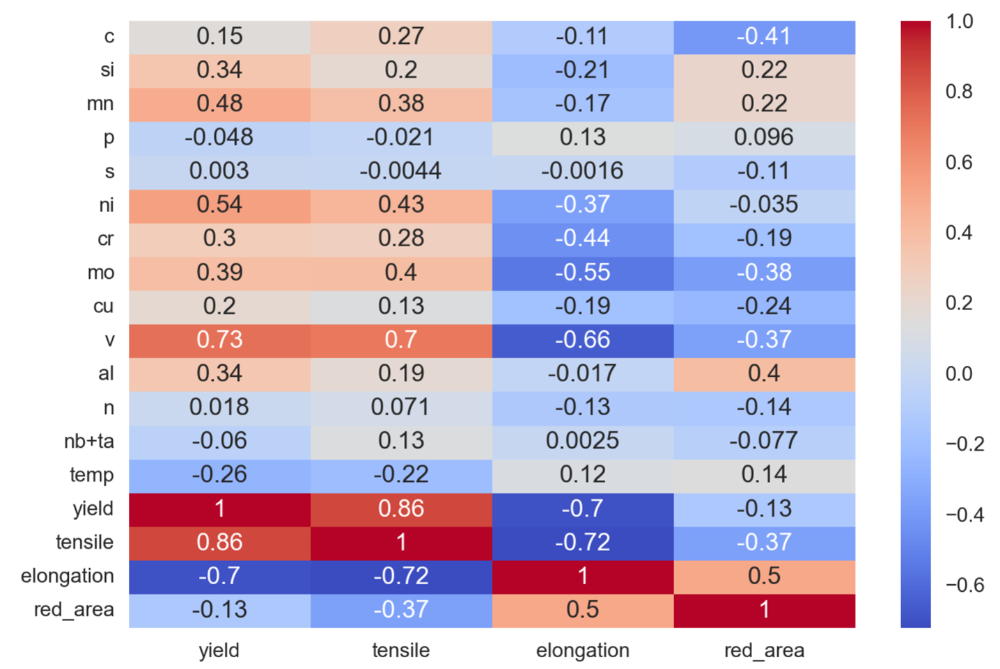
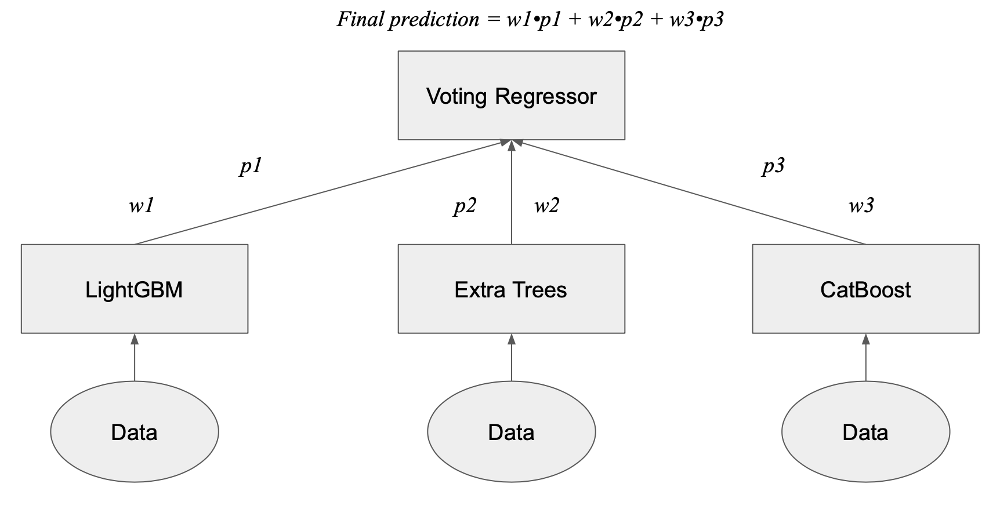

Predicting Steel Strength: A Regression-based Machine Learning Approach
==============================

_Steel, primarily made from Iron is one of the most important and ubiqutous materials in modern society. In this project, an Emnsemble Regressor, a machine learning model, was developed to predict the strength of a steel sample based on its chemsitry and temperature.
Predicting steel strength from steel chemistry_

## Data

Data was obtained from a now unavailble datadaset on Kaggle 
[Steel dataset](https://www.kaggle.com/datasets/rohannemade/mechanical-properties-of-low-alloy-steels?resource=download)

The dataset has 618 observations. Each of these correspond to a steel sample being pulled at a certain temperature. The sample's strength parameters (Tensile, Yield, Reduction in area, Elongation) are features as well as its chemistry. Yield strength was chsoen to be the target variable so the others were dropped from the dataset. The sample below is the data after cleaning and removing unneccesary features:

A temperature range was chosen between 25˚C and 450˚C. 

## EDA

The correlations between the featues and yield strength are shows below:

Four elements, Vanadium (v), Molybdenum (mo), Nickel (ni) and Manganese (mn) play a big positive role in determining strength. Temperature also plays a huge role in negatively influencing strength which is expected as higher temperatures allow for easier movement of dislocations.

## Modelling

The package pycaret was used to perform a preliminary search to find the top models to perform the regression. The models from this analysis would be fed into an ensemble Voting Regressor. The models with the best overall performance were

1. CatBoost Regressor (CAT)
2. Light Gradient Boosting Machine (LGBM)
3. ExtraTrees Regressor (XT)

The CatBoost Regressor, Light Gradient Boosting Machine and Extra Trees Regressor were chosen to be input into a Voting Regressor. In the report, the feature importances of all 3 models is found in the report. Vanadium was common in the CatBoost and XT models while Molybdenum, Nickel and Manganese were common to all three. The LGBM model did put quite a bit of importance on temperature which isn't ideal since most of the samples were pulled at temperates >25˚C.

Shown below is the method the Voting Regressor used for predictions

The weighted average of the prediction from each regressor is the final prediction from this model.

Project Organization
------------

    ├── LICENSE
    ├── Makefile           <- Makefile with commands like `make data` or `make train`
    ├── README.md          <- The top-level README for developers using this project.
    ├── data
    │   ├── external       <- Data from third party sources.
    │   ├── interim        <- Intermediate data that has been transformed.
    │   ├── processed      <- The final, canonical data sets for modeling.
    │   └── raw            <- The original, immutable data dump.
    │
    ├── docs               <- A default Sphinx project; see sphinx-doc.org for details
    │
    ├── models             <- Trained and serialized models, model predictions, or model summaries
    │
    ├── notebooks          <- Jupyter notebooks. Naming convention is a number (for ordering),
    │                         the creator's initials, and a short `-` delimited description, e.g.
    │                         `1.0-jqp-initial-data-exploration`.
    │
    ├── references         <- Data dictionaries, manuals, and all other explanatory materials.
    │
    ├── reports            <- Generated analysis as HTML, PDF, LaTeX, etc.
    │   └── figures        <- Generated graphics and figures to be used in reporting
    │
    ├── requirements.txt   <- The requirements file for reproducing the analysis environment, e.g.
    │                         generated with `pip freeze > requirements.txt`
    │
    ├── setup.py           <- makes project pip installable (pip install -e .) so src can be imported
    ├── src                <- Source code for use in this project.
    │   ├── __init__.py    <- Makes src a Python module
    │   │
    │   ├── data           <- Scripts to download or generate data
    │   │   └── make_dataset.py
    │   │
    │   ├── features       <- Scripts to turn raw data into features for modeling
    │   │   └── build_features.py
    │   │
    │   ├── models         <- Scripts to train models and then use trained models to make
    │   │   │                 predictions
    │   │   ├── predict_model.py
    │   │   └── train_model.py
    │   │
    │   └── visualization  <- Scripts to create exploratory and results oriented visualizations
    │       └── visualize.py
    │
    └── tox.ini            <- tox file with settings for running tox; see tox.readthedocs.io

--------

<small>Project based on the <a target="_blank" href="https://drivendata.github.io/cookiecutter-data-science/">cookiecutter data science project template</a>. #cookiecutterdatascience</small>

