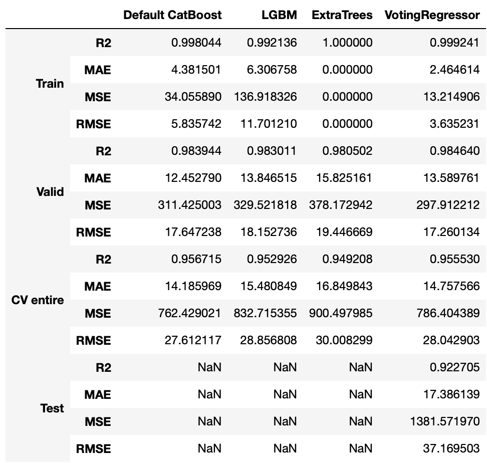

## Brief Summary:

# Predicting Steel Strength: A Regression-based Machine Learning Approach
==============================

_Steel, primarily made from iron, is one of the most important and ubiquitous materials in modern society. In this project, an Ensemble Regressor, a machine learning model, was developed to predict the strength of a steel sample based on its chemistry and temperature. Predicting steel strength from steel chemistry_


## Data

Data was obtained from a now unavailable dataset on Kaggle
[Steel dataset](https://www.kaggle.com/datasets/rohannemade/mechanical-properties-of-low-alloy-steels?resource=download)

The dataset has 618 observations. Each of these corresponds to a steel sample being pulled at a certain temperature. The machine that performs this strength test, a universal testing machine, is shown below. It gathers this data by determining the force (and the resulting stress) required to pull a material up to failure. The sample's strength parameters (Tensile, Yield, Reduction in area, Elongation) are features as well as its chemistry. Yield strength was chosen to be the target variable so the other strength metrics were dropped from the dataset. The sample below is the data after cleaning and removing unnecessary features:

A temperature range was chosen between 25˚C and 450˚C. 


## EDA

The correlations between the features and Yield strength are shown below:


Four elements, Vanadium (V), Molybdenum (Mo), Nickel (Ni) and Manganese (Mn) play a big positive role in determining strength. Temperature also plays a huge role in negatively influencing strength which is expected as higher temperatures allow for easier movement of dislocations and thus weaker steel.


## Preprocessing

The data was split into training, test and validation sets with a 7:2:1 split respectively. A validation set was created to assess the model’s performance more robustly. All features, X data, were fit and transformed on X_train using a Standard Scaler and were transformed on X_val and X_test. The y data, target variable, was kept as is


## Modelling

The package pycaret was used to perform a preliminary search to find the top models to perform the regression. The models from this analysis would be fed into an ensemble Voting Regressor. The models with the best overall performance were

    CatBoost Regressor (CAT)
    Light Gradient Boosting Machine (LGBM)
    ExtraTrees Regressor (XT)

The CatBoost Regressor (CAT), Light Gradient Boosting Machine (LGBM) and Extra Trees Regressor (XT) were chosen to be input into a Voting Regressor. The feature importance of all 3 models is found in the report. Vanadium was a common influencing factor in the CAT and XT models while molybdenum, nickel and manganese had a large influence in all three. The LGBM model did put quite a bit of importance on temperature which isn't ideal since most of the samples were pulled at temperatures >25˚C.


### Ensemble Model

From these three models, an ensemble Voting Regressor model was built. The model returns a  weighted average of the predictions from each of the three base models, which is the final prediction. The weights were determined by iteratively assigning a weight (between 0 and 0.9) to each model, similar to a grid search, and retrieving the evaluation metrics from each iteration. Using this method, the optimal weights discovered were 0.3, 0.6 and 0.1 corresponding to CAT, LGBM and XT respectively. This strategy was chosen since the power in this meta-model comes from its diversity. Any predictions from one model that suffer when predicting one particular section of data can be compensated for by the predictions of the other two. It is also more flexible when predicting based on different types of data.

```python
# Weights will be assigned iteratively to each model in a Voting Regressor to discover the most accurate model

# Initialize empty lists for CatBoost weights
weights1 = list()

# Initialize empty list for LGBM weights
weights2 = list()

# Initialize empty list for ExtraTrees weights
weights3 = list()

# Empty list for scoring
mae_loss = list()

# All weights range (0.1,0.9)

# Looping through CatBoost weights
for i in np.arange(0.1,1,0.1):
    
    # Looping through LGBM weights
    for j in np.arange(0.1,1,0.1):
        
        # Looping through ExtraTrees weights
        for k in np.arange(0.1,1,0.1):
            
            # Initializing VotingRegressor with to be determined weights
            vote_reg = VotingRegressor([('cat', cat), ('lgbm', lgbm), ('xt', best_xt)], weights = [i,j,k])
            # Fitting onto training data
            vote_reg.fit(X_train, y_train)
            # Getting predictions
            y_pred = vote_reg.predict(X_test)
            # Getting MAE
            mae_loss = mean_absolute_error(y_pred, y_test)
            
            # Appending scores and weights to respective lists
            loss.append(mae_loss)
            weights1.append(i)
            weights2.append(j)
            weights3.append(k)
```

Shown below is the a diagram of the Voting Regressor structure


The metrics of each individual model as well as the ensemble Voting Regressor is shown below.




## Discussion and Conclusion


Both XT and CAT weigh a high importance on the elements that are the most correlated with steel strength. They also don’t place as much importance on temperature which, as mentioned, isn’t a very important feature. This ties in to the highest contributing features of LGBM. Even though it places a high importance on LGBM, it does weigh the other elements as important as well more equally than XT or CAT which is beneficial since XT’s predictions are very reliant on Vanadium and less so for the other elements. Accuracy using these models could be an issue for datasets that don’t contain as much Vanadium especially because many of the samples do not contain Vanadium.  Even though the Voting Regressor is marginally less accurate than XT, the latter was still chosen as the final model since it's be more generalizable to new data as mentioned above.

For this business use case, both MAE and RMSE are used to judge the model's performance. Metallurgists need only a rough estimate of steel performance. The Voting Regressor ensemble model socred an MAE of ~14 MPa, RMSE of ~28 MPa, and an R2 of 0.96 when cross-validating. Considering the mean Yield strength of the set is 361 MPa, its performance is excellent for this use case.

An evaluation was done on a subset of the data at a temperature of 27˚C (around room temperature). Firstly, all observations recorded at 27˚C were indexed. Using this index, new X and Y datasets were created. These new sets were also cleared of any training data. To reiterate, the resulting dataset (25 observations) was comprised exclusively of test and validation data recorded at 27˚C. The results are shown below:


[](/reports/figures/metrics_27.png)


When scored on the new test and validation data, the model still performed quite well during cross-validation. Its MAE was ~27 MPa, RMSE was ~39 MPa and R2 was 0.91 which is lower than the results when the model was fitted to all the data but still quite usable.

Due to the reasons specified above, the final model was chosen to be the ensemble Voting Regressor.


Project Organization
------------

    ├── LICENSE
    ├── README.md          
    ├── data
    │   ├── external       <- Data from third party sources.
    │   ├── interim        <- Intermediate data that has been transformed.
    │   └── raw            <- The original, immutable data dump.
    │
    │
    ├── models             <- Trained and serialized models, model predictions, or model summaries
    │
    ├── notebooks          <- Jupyter notebooks. Naming convention is a number (for ordering),
    │          
    │
    ├── reports            <- Generated analysis as DOCX, PDF
    │   └── figures        <- Generated graphics and figures to be used in reporting

--------

<p><small>Project based on the <a target="_blank" href="https://drivendata.github.io/cookiecutter-data-science/">cookiecutter data science project template</a>. #cookiecutterdatascience</small></p>
